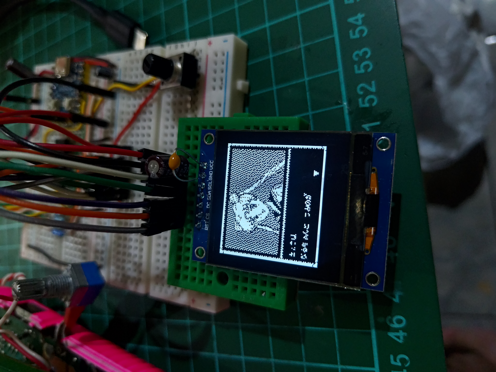

# DMG Boy Display: Real-Time Game Boy LCD Capture System

📋 **[Complete PCB Schematics & BOM Available](schematics/)**

A high-performance Game Boy LCD capture and display system for the Raspberry Pi Pico, supporting multiple TFT display types with hardware-accelerated PIO capture and DMA-optimized rendering.

## 📸 Preview Gallery


| ST7789 (240x240) | ILI9341 (240x320) | ILI9342 (240x320) | ST7796 (320x480) | SH1107 OLED (128x128) |
|:-----------------:|:------------------:|:------------------:|:-----------------:|:--------------------:|
|  |  |  |  |  |
| 1.5x Scaling, Centered | 1.5x Scaling, Top Aligned | 1.5x Scaling, Top Aligned | 2x Scaling, Top Aligned | Floyd-Steinberg Dither, B&W |

| RP2040-Zero Compact | SH1107 OLED Video Demo |
|:-------------------:|:---------------------:|
|  | [](preview/sh1107_Monochroe_OLED.mp4) |
| Compact 60% Smaller Build | Monochrome OLED in Action |

📁 **More photos and videos, including new preview images, are available in the [preview/](preview/) folder**

## 📱 Follow My Projects

**🔥 Follow [@rusaakkmods](https://www.instagram.com/rusaakkmods/) on Instagram for more retro gaming mods and electronics projects!**

👍 **Like and follow for:**
- Behind-the-scenes development
- New project updates  
- Retro gaming modifications
- Electronics tutorials

## 🎮 What It Does


This project captures the LCD data from a Game Boy (DMG) in real-time and displays it on modern TFT screens with the following features:

- **Real-Time Capture**: Uses RP2040's PIO (Programmable I/O) for hardware-timed Game Boy LCD signal capture
- **Multi-Display Support**: ST7789, ILI9341, ILI9342, ST7796, and SH1107 OLED displays with optimized drivers
- **Intelligent Scaling**: Automatic resolution scaling with display-specific optimizations
- **Advanced Dithering**: Floyd-Steinberg and Bayer dithering algorithms for monochrome displays
- **DMA Acceleration**: Hardware DMA for fast image transfers and smooth frame rates
- **Color Mapping**: Authentic Game Boy green color palettes for each display type
- **Zero Lag**: Hardware-level capture with minimal latency

## 🖥️ Supported Displays

### ST7789 (240x240)
- **SPI Speed**: 40MHz
- **Scaling**: 1.5x (160x144 → 240x216)
- **Position**: Vertically centered
- **Colors**: Classic Game Boy green tones

### ILI9341 (240x320)
- **SPI Speed**: 40MHz
- **Scaling**: 1.5x (160x144 → 240x216)
- **Position**: Top aligned
- **Colors**: Optimized green palette

### ILI9342 (240x320) *(New!)*
- **SPI Speed**: 40MHz
- **Scaling**: 1.5x (160x144 → 240x216)
- **Position**: Top aligned
- **Colors**: Optimized green palette
- **Notes**: Drop-in replacement for ILI9341 with improved compatibility

### ST7796 (320x480)
- **SPI Speed**: 62.5MHz
- **Scaling**: 2x (160x144 → 320x288)
- **Position**: Top aligned
- **Features**: Enhanced performance optimizations

### SH1107 OLED (128x128) *(New!)*
- **SPI Speed**: 8MHz
- **Resolution**: 128x128 monochrome OLED
- **Scaling**: 0.8x (160x144 → 128x115)
- **Position**: Centered
- **Dithering**: Floyd-Steinberg or Bayer dithering for black & white conversion
- **Features**: Ultra-low power consumption, high contrast ratio

## 🎨 Advanced Dithering Algorithms

### Floyd-Steinberg Dithering *(New!)*
High-quality error diffusion dithering algorithm that provides superior image quality for monochrome displays:
- **Better Quality**: Superior visual results compared to ordered dithering
- **Error Diffusion**: Distributes quantization errors to neighboring pixels
- **Ideal for**: Static images and high-quality monochrome conversion
- **Usage**: Automatically enabled for SH1107 OLED displays

### Bayer Ordered Dithering
Fast, efficient ordered dithering using an 8x8 Bayer matrix:
- **High Performance**: Minimal CPU overhead, perfect for real-time applications
- **Consistent Pattern**: Stable, repeatable dithering pattern
- **Real-time Friendly**: Optimized for continuous Game Boy capture
- **Fallback Option**: Alternative to Floyd-Steinberg when performance is critical

### Black & White (Monochrome) Feature for OLED/Monochrome Displays
For future OLED and other monochrome (1-bit) display support, a new black-and-white mode is available. This mode uses a simple, fast 8x8 Bayer ordered dithering algorithm (instead of the more CPU-intensive Floyd-Steinberg method) to simulate grayscale on black-and-white screens. This approach is chosen for its efficiency and suitability for microcontrollers, making it ideal for OLED and similar displays. Enable this in the display configuration for best results on monochrome hardware.

> **Note:** The Bayer dither is much less CPU-intensive than Floyd-Steinberg, making it a better fit for real-time applications on the RP2040.

## 🔧 Hardware Requirements

### Raspberry Pi Pico
- RP2040 microcontroller
- Standard Pico board or Pico W

### PCB & Components
📋 **[Complete schematics, PCB design, and BOM](schematics/)** available in KiCad format
- Custom PCB recommended for reliable connections
- Through-hole components for easy assembly
- All parts available from common distributors

### Game Boy Connection (DMG-01 Flex Cable)
| Signal | GameBoy LCD Connector | Pico Pin | Description |
|--------|----------------------|----------|-------------|
| GND | Pin 21 | GND | Ground |
| Pixel Clock | Pin 14 | GP2 | LCD pixel clock signal |
| Data 0 | Pin 15 | GP3 | LCD data bit 0 |
| Data 1 | Pin 16 | GP4 | LCD data bit 1 |
| Vertical Sync | Pin 12 | GP5 | LCD vertical sync signal |
| Regulated +5V | Pin 11 | VSYS | Power Supply |

### Display Connection (SPI)
| Signal | Pico Pin | Description |
|--------|----------|-------------|
| MOSI   | GPIO 11  | SPI Data Output |
| SCK    | GPIO 10  | SPI Clock |
| CS     | GPIO 9   | Chip Select |
| DC     | GPIO 12  | Data/Command |
| RESET  | GPIO 13  | Display Reset |
| BL     | GPIO 8   | Backlight Control |

## 🚀 Quick Start

### 1. Clone Repository
```bash
git https://github.com/rusaakkmods/dmg_boy_display
cd dmg_boy_display
```

### 2. Configure Display Type
Edit `main.cpp` and uncomment your display type:
```cpp
// Choose display type: uncomment one of these lines
//#define USE_ST7789
//#define USE_ILI9341
//#define USE_ILI9342
//#define USE_ST7796
#define USE_SH1107    // ← Uncomment your display
```

### 3. Build with Ninja (Recommended)
```bash
# Create build directory
mkdir build && cd build

# Configure with Ninja generator (faster builds)
cmake -G Ninja ..

# Build project
ninja

# Flash to Pico
cp dmg_boy_display.uf2 /path/to/pico/drive/
```

### Alternative: Standard Make
```bash
mkdir build && cd build
cmake ..
make -j4
```

## 🏗️ Project Structure

```
├── main.cpp                     # Main application
├── CMakeLists.txt               # Build configuration
├── include/                     # Header files
│   ├── logo.h                  # Logo graphics data
│   ├── dither.hpp              # Dithering algorithms (NEW)
│   ├── scaler.hpp              # Image scaling utilities
│   └── displays/               # Display drivers
│       ├── st7789/            # ST7789 driver
│       ├── ili9341/           # ILI9341 driver
│       ├── ili9342/           # ILI9342 driver
│       ├── ili9488/           # ILI9488 driver (future)
│       ├── sh1107/            # SH1107 OLED driver (NEW)
│       └── st7796/            # ST7796 driver
├── src/                        # Source implementations
│   ├── dither.cpp             # Dithering algorithms (NEW)
│   ├── scaler.cpp             # Image scaling utilities
│   └── displays/              # Driver implementations
│       ├── st7789/            # ST7789 source files
│       ├── ili9341/           # ILI9341 source files
│       ├── ili9342/           # ILI9342 source files
│       ├── ili9488/           # ILI9488 source files
│       ├── sh1107/            # SH1107 OLED source files (NEW)
│       └── st7796/            # ST7796 source files
├── pio/gblcd/                 # PIO programs
│   ├── gblcd.pio             # Game Boy LCD capture
│   └── README.md             # PIO documentation
└── .gitignore                 # Git ignore rules
```

## ⚡ Performance Features

### Hardware Acceleration
- **PIO Capture**: Dedicated state machine for precise Game Boy timing
- **DMA Transfers**: Zero-CPU image copying for smooth frame rates
- **Optimized Scaling**: Pre-computed lookup tables and unrolled loops
- **Advanced Dithering**: Hardware-optimized Floyd-Steinberg and Bayer algorithms

### Display-Specific Optimizations
- **ST7796**: 2x pixel scaling with loop unrolling
- **SH1107 OLED**: Optimized monochrome conversion with dithering
- **Color Lookup**: Pre-computed Game Boy color palettes
- **Buffer Management**: Optimized buffer sizes per display

### Build System
- **Ninja Generator**: Recommended for faster compilation
- **Simplified CMake**: Clean, maintainable build configuration
- **Multi-target**: Single executable with compile-time display selection

## 🔧 Advanced Configuration

### Custom Pin Mapping
Modify pin assignments in `main.cpp`:
```cpp
config.pin_din = 11;    // MOSI
config.pin_sck = 10;    // SCK
config.pin_cs = 9;      // CS
config.pin_dc = 12;     // DC
config.pin_reset = 13;  // RESET
config.pin_bl = 8;      // Backlight
```

### SPI Speed Tuning
Adjust SPI frequencies for your setup:
```cpp
// Conservative (stable)
config.spi_speed_hz = 25 * 1000 * 1000;  // 25MHz

// Aggressive (maximum performance)
config.spi_speed_hz = 62.5 * 1000 * 1000;  // 62.5MHz
```

### DMA Buffer Optimization
Tune buffer sizes for performance:
```cpp
config.dma.buffer_size = 4096;  // Larger = smoother, more RAM
```

### Dithering Algorithm Selection
Choose between dithering algorithms for monochrome displays:
```cpp
// High quality Floyd-Steinberg (slower, better quality)
floyd_steinberg_dither(buffer, width, height, palette, white, black);

// Fast Bayer ordered dithering (faster, good quality)
fast_bayer_dither(buffer, width, height, palette, white, black);
```

## 🐛 Troubleshooting

### Build Issues
```bash
# Clean build
rm -rf build/
mkdir build && cd build
cmake -G Ninja ..
ninja
```

### Display Problems
1. **No Image**: Check SPI connections and power
2. **Wrong Colors**: Verify display type in `main.cpp`
3. **Slow Frame Rate**: Increase SPI speed or enable DMA

### Game Boy Capture Issues
1. **No Signal**: Verify Game Boy LCD connections
2. **Corrupted Image**: Check PIO timing configuration
3. **Sync Problems**: Ensure proper VSync connection

## 📚 Technical Details

### Game Boy LCD Timing
- **Resolution**: 160x144 pixels
- **Refresh Rate**: ~59.7 Hz
- **Color Depth**: 2-bit (4 shades of green)

### Scaling Algorithms
- **1.5x Scaling**: 160→240, 144→216 (ST7789/ILI9341)
- **2x Scaling**: 160→320, 144→288 (ST7796)
- **Nearest Neighbor**: Preserves pixel art aesthetic

### Memory Usage
- **Source Buffer**: 46KB (160x144x2 bytes)
- **Scaled Buffer**: 101KB-180KB (depending on display)
- **SH1107 Buffer**: 2KB (128x128÷8 bytes for monochrome)
- **Dithering Buffer**: 32KB temporary space for Floyd-Steinberg
- **Total RAM**: ~230KB (fits comfortably in RP2040's 264KB)

## 🛠️ Development

### Adding New Displays
1. Create driver files in `include/displays/newdisplay/`
2. Implement source files in `src/displays/newdisplay/`
3. Add display type to `main.cpp`
4. Update `CMakeLists.txt`

### Performance Profiling
Use Pico's built-in profiling:
```cpp
#include "pico/time.h"
absolute_time_t start = get_absolute_time();
// ... your code ...
int64_t elapsed = absolute_time_diff_us(start, get_absolute_time());
```

## 📄 License

This project is open source. See individual files for license information.

## 🤝 Contributing

1. Fork the repository
2. Create a feature branch
3. Test thoroughly on hardware
4. Submit a pull request

## 🙏 Credits

- Thanks to What's Ken Making Youtube Channel, finally I can finish my project. 
  Please follow his Youtube Channel: https://www.youtube.com/@whatskenmaking
- To my kooky AI Claude 4 for assisting me with code optimization, also for it's artificial apologize :D

## 📱 Connect With Me

**Follow [@rusaakkmods](https://www.instagram.com/rusaakkmods/) on Instagram!**

🔥 **Like, follow, and stay updated with:**
- New electronics projects
- Retro gaming modifications  
- Development progress
- Hardware tutorials
- Behind-the-scenes content


