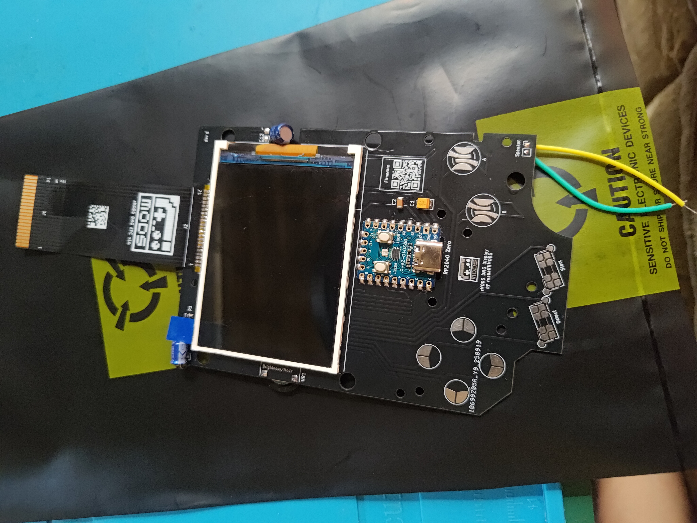
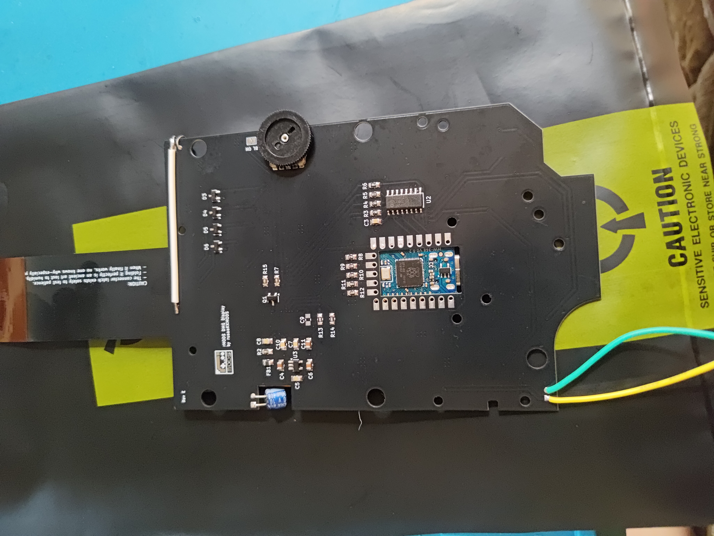

# DMG Boy Display - Hardware Boards

This document describes the different hardware board versions for the DMG Boy Display project. Each version has specific pin assignments and features that require corresponding firmware builds.

## Hardware Version Identification

### Version v1.0 (Legacy)
 

**Key Features:**
- **PCB Color**: Black with white silkscreen
- **Microcontroller**: RP2040 Zero module
- **Display**: ILI9341 3.2" TFT (320x240)
- **Controls**: Single potentiometer for palette selection
- **SPI Interface**: SPI1 (dedicated for display)
- **Game Boy Capture**: GPIO 2-5 (sequential)

**Physical Identification:**
- Compact single-board design
- Potentiometer (blue trimmer) on the back
- RP2040 Zero module mounted on back
- Simple, minimalist layout

**Pin Configuration:**
```
Game Boy Capture (GPIO 2-5):
├── GPIO 2: CPG (Clock Pulse Generator)
├── GPIO 3: LD0 (Data Bit 0)
├── GPIO 4: LD1 (Data Bit 1)
└── GPIO 5: VSYNC (Vertical Sync)

Display SPI1 (GPIO 9-13):
├── GPIO 9:  CS (Chip Select)
├── GPIO 10: SCK (Serial Clock)
├── GPIO 11: MOSI (Master Out Slave In)
├── GPIO 12: DC (Data/Command)
└── GPIO 13: RST (Reset)

Controls:
└── GPIO 29: Palette ADC (10K trimmer)
```

### Version v1.1 (Current)
 

**Key Features:**
- **PCB Color**: Black with white silkscreen
- **Microcontroller**: RP2040 Zero module
- **Display**: ILI9341 3.2" TFT (320x240)
- **Controls**: Potentiometer + Mode switch (palette/brightness)
- **SPI Interface**: SPI0 (optimized routing)
- **Game Boy Capture**: GPIO 9-12 (sequential)

**Physical Identification:**
- Enhanced control interface
- Additional tactile switches on front panel
- Mode switch for palette/brightness selection
- More complex component layout
- Professional finish with component labels

**Pin Configuration:**
```
Game Boy Capture (GPIO 9-12):
├── GPIO 9:  CPG (Clock Pulse Generator)
├── GPIO 10: LD0 (Data Bit 0)
├── GPIO 11: LD1 (Data Bit 1)
└── GPIO 12: VSYNC (Vertical Sync)

Display SPI0 (GPIO 3-7):
├── GPIO 3: MOSI (Master Out Slave In)
├── GPIO 4: DC (Data/Command)
├── GPIO 5: CS (Chip Select)
├── GPIO 6: SCK (Serial Clock)
└── GPIO 7: RST (Reset)

Controls:
├── GPIO 2:  Mode Switch (LOW=brightness, HIGH=palette)
├── GPIO 8:  Backlight PWM
└── GPIO 29: Control ADC (10K potentiometer)
```

## Hardware Comparison

| Feature | v1.0 | v1.1 |
|---------|------|-------|
| **Microcontroller** | RP2040 Zero | RP2040 Zero |
| **Display** | ILI9341 3.2" | ILI9341 3.2" |
| **SPI Interface** | SPI1 (GPIO 9-13) | SPI0 (GPIO 3-7) |
| **Game Boy Capture** | GPIO 2-5 | GPIO 9-12 |
| **Control Interface** | Single potentiometer | Potentiometer + Mode switch |
| **Brightness Control** | GPIO on/off | PWM brightness |
| **Pin Conflicts** | None | Resolved via redesign |
| **Features** | Basic palette selection | Advanced palette + brightness |

## Firmware Compatibility

### Building for Specific Hardware

The build system automatically generates firmware for both hardware versions:

```bash
# Build both versions (recommended)
./build_all.sh

# Generated firmware files:
# - dmg_boy_display_v1_0.uf2   (for v1.0 hardware)
# - dmg_boy_display_v1_1.uf2   (for v1.1 hardware)
```

### Manual CMake Configuration

For custom builds targeting specific hardware:

```bash
# Build for v1.0 hardware
cmake -B build -DVERSION_V1_0=ON
ninja -C build

# Build for v1.1 hardware  
cmake -B build -DVERSION_V1_1=ON
ninja -C build
```

## Hardware Setup Guide

### Game Boy Connection

Both versions connect to the Game Boy LCD flex cable, but use different GPIO pins:

**v1.0 Connections:**
- Connect Game Boy LCD pins to GPIO 2-5
- Ensure proper signal integrity with short wires
- No level shifting required (3.3V compatible)

**v1.1 Connections:**
- Connect Game Boy LCD pins to GPIO 9-12
- Improved pin separation reduces crosstalk
- Better routing for signal integrity

### Display Installation

Both versions use the same ILI9341 display but different SPI interfaces:

**v1.0 Display:**
- Uses SPI1 interface (GPIO 9-13)
- Standard SPI wiring
- Manual backlight control

**v1.1 Display:**
- Uses SPI0 interface (GPIO 3-7)
- Optimized for better performance
- PWM backlight control

### Control Interface

**v1.0 Controls:**
- Single 10K potentiometer on GPIO 29
- Direct palette selection
- Simple, reliable operation

**v1.1 Controls:**
- 10K potentiometer on GPIO 29 (multi-function)
- Mode switch on GPIO 2 (palette/brightness)
- Advanced control interface

## Troubleshooting

### Wrong Firmware Version

**Symptoms:**
- Display shows garbage or wrong rotation
- Controls don't respond properly
- Game Boy capture not working

**Solution:**
1. Identify your hardware version using photos above
2. Flash the correct firmware file:
   - v1.0 hardware → `dmg_boy_display_v1_0.uf2`
   - v1.1 hardware → `dmg_boy_display_v1_1.uf2`

### Hardware Identification

If unsure about your hardware version:

1. **Check GPIO Usage:**
   - Measure continuity from Game Boy connector to GPIO pins
   - v1.0: Game Boy signals on GPIO 2-5
   - v1.1: Game Boy signals on GPIO 9-12

2. **Visual Inspection:**
   - v1.0: Simpler layout, single potentiometer
   - v1.1: Additional switches, more complex layout

3. **SPI Interface:**
   - v1.0: Display connected to GPIO 9-13
   - v1.1: Display connected to GPIO 3-7

### Performance Issues

**SPI Speed Problems:**
- Try 40MHz SPI speed for stability: `./build_all.sh --spi-40`
- 62.5MHz may cause issues with longer wires or poor connections

**Display Artifacts:**
- Check power supply stability (5V, adequate current)
- Verify all SPI connections are secure
- Ensure proper grounding between Game Boy and display board

## Firmware Features by Version

### v1.0 Features
- ✅ Game Boy LCD capture
- ✅ Palette selection via potentiometer
- ✅ Multiple color palettes
- ✅ Display test patterns
- ✅ Simple brightness control (on/off)

### v1.1 Features  
- ✅ All v1.0 features
- ✅ Advanced mode switching (palette/brightness)
- ✅ PWM brightness control
- ✅ Enhanced control interface
- ✅ Optimized pin routing

## Build Configuration

Both hardware versions support the same build options:

```bash
# Available build options for both versions:
./build_all.sh --test           # Test pattern mode
./build_all.sh --dither-fast    # Fast dithering
./build_all.sh --dither-best    # Best quality dithering  
./build_all.sh --no-palette     # Disable palette selection
./build_all.sh --spi-40         # 40MHz SPI (stable)
./build_all.sh --spi-62.5       # 62.5MHz SPI (fast)
./build_all.sh --offset-x=-1    # Adjust display X position
./build_all.sh --offset-y=3     # Adjust display Y position
./build_all.sh --offset-x=-5 --offset-y=2  # Both X and Y adjustments
```

## Support

For hardware-specific issues:
1. Verify you're using the correct firmware for your hardware version
2. Check the [main README](../README.md) for general troubleshooting
3. Refer to the [BUILD_GUIDE.md](../BUILD_GUIDE.md) for configuration options

---

**Note**: Always use the firmware that matches your hardware version. Cross-flashing (using v1.0 firmware on v1.1 hardware or vice versa) will result in incorrect operation and may damage the hardware.