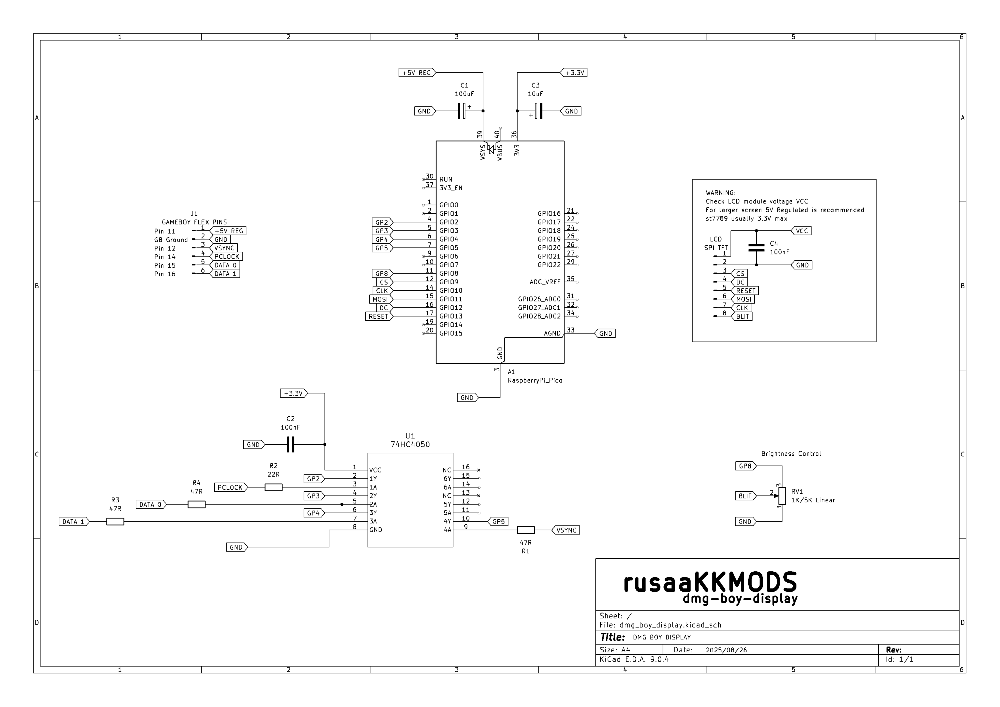

# DMG Boy Display - Schematic & PCB Design

This folder contains the complete KiCad project files for the DMG Boy Display PCB.

## 📋 Schematic Preview

*Complete schematic showing Game Boy LCD interface and TFT display connections*

## 🛠️ Bill of Materials (BOM)

### Core Components
| Qty | Reference | Value | Package | Description | Datasheet |
|-----|-----------|-------|---------|-------------|-----------|
| 1 | A1 | RaspberryPi_Pico | THT Module | RP2040 Development Board | [Pico Datasheet](https://datasheets.raspberrypi.com/pico/pico-datasheet.pdf) |
| 1 | U1 | 74HC4050 | N16_TEX | Hex Non-Inverting Buffer | CD74HC4050EG4 |

### Display Interface Components  
| Qty | Reference | Value | Package | Description | Notes |
|-----|-----------|-------|---------|-------------|-------|
| 1 | LCD | SPI TFT | Various | TFT Display Module | ST7789/ILI9341/ST7796 |

### Passive Components
| Qty | Reference | Value | Package | Description | Notes |
|-----|-----------|-------|---------|-------------|-------|
| 3 | R1,R3,R4 | 47Ω | 0805/THT | Current limiting resistors | Signal conditioning |
| 1 | R2 | 22Ω | 0805/THT | Series resistor | Signal integrity |
| 1 | RV1 | 1K/5K Linear | THT | Potentiometer | Brightness/contrast control |
| 1 | C1 | 100μF | Electrolytic | Power supply capacitor | Bulk decoupling |
| 2 | C2,C4 | 100nF | 0805/THT | Ceramic capacitors | High-freq decoupling |
| 1 | C3 | 10μF | 0805/THT | Tantalum/Ceramic | Power filtering |

### TFT Display Connection (LCD)
The SPI TFT display connects directly to Raspberry Pi Pico pins:
| Signal | Pico GPIO | Description | Voltage Notes |
|--------|-----------|-------------|---------------|
| **VCC** | **3V3/5V** | **Power supply** | **⚠️ See power requirements below** |
| GND | GND | Ground | - |
| CS | GP17 | Chip select | 3.3V logic |
| RESET | GP15 | Display reset | 3.3V logic |
| DC | GP20 | Data/command | 3.3V logic |
| MOSI | GP19 | SPI data | 3.3V logic |
| SCK | GP18 | SPI clock | 3.3V logic |
| BL | RV1 Wiper | Backlight control | 3.3V logic |

### ⚠️ Display Power Requirements (VCC)

**IMPORTANT**: Please review your display module's voltage requirements before connecting!

#### Power Options:
1. **3.3V Power (Default/Safe)**
   - Use Pico's 3V3 output
   - ✅ **Safe for all display types**
   - ✅ **ST7789 recommended** (3.3V max)
   - ✅ **Most common configuration**

2. **5V Power (For larger screens)**
   - Use regulated 5V from Game Boy power supply
   - ⚠️ **Check display voltage tolerance first**
   - ✅ **Better for larger displays (3.5"+ screens)**
   - ✅ **Brighter backlight performance**

#### Critical Warnings:
- 🚨 **ST7789 displays**: Usually require **3.3V maximum** - using 5V may damage the display!
- 🚨 **ILI9341 displays**: Check datasheet - some accept 5V, others are 3.3V only
- 🚨 **ST7796 displays**: Most accept 3.3V-5V, but verify your specific module
- 🚨 **Always check your display breakout board specifications**

#### Recommended Approach:
1. **Start with 3.3V** for initial testing (safest option)
2. **Check display performance** - if backlight is too dim for larger screens
3. **Verify 5V compatibility** in your display's datasheet
4. **Only then switch to 5V** if needed and confirmed safe
- **74HC4050 (U1)**: Hex non-inverting buffer for Game Boy signal conditioning
- **RV1 (1K/5K)**: Potentiometer for brightness/contrast adjustment
- **R1,R3,R4 (47Ω)**: Current limiting resistors for signal integrity
- **R2 (22Ω)**: Series resistor for signal conditioning
- **C1 (100μF)**: Bulk power supply decoupling
- **C2,C4 (100nF)**: High-frequency noise filtering
- **C3 (10μF)**: Additional power supply filtering

## 🔍 Design Validation

### Signal Integrity
✅ Proper impedance control for SPI signals  
✅ Adequate ground plane coverage  
✅ Decoupling capacitors near power pins  
✅ Short trace lengths for high-speed signals  

### Power Integrity  
✅ Dedicated power planes  
✅ Power supply filtering  
✅ Current capacity analysis  
✅ Thermal considerations  

## 📧 Support

For questions about the PCB design:
- 📱 Follow [@rusaakkmods](https://www.instagram.com/rusaakkmods/) on Instagram
- 🐛 Open an issue in this repository
- 💬 Discussion in project README

---

**PCB Design by [@rusaakkmods](https://www.instagram.com/rusaakkmods/)**